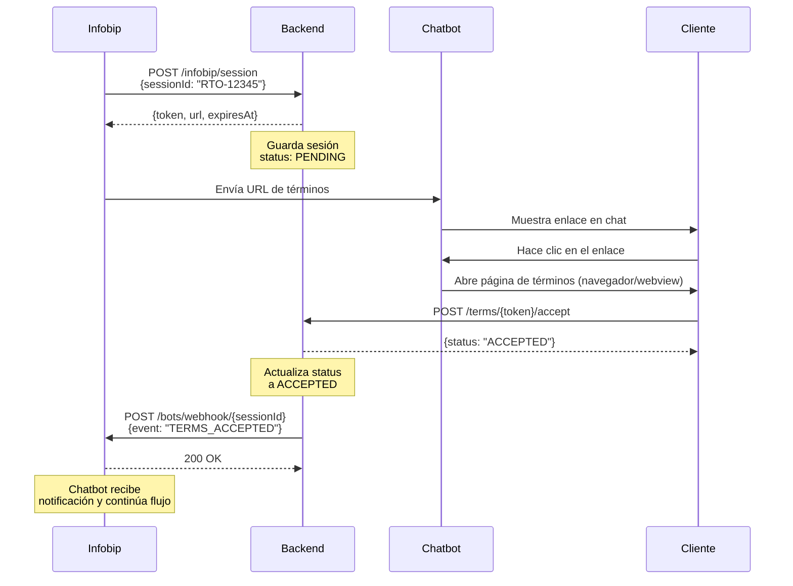

# Flujo de Integración con Infobip - Términos y Condiciones

## 🔄 Flujo Completo

```
1. INFOBIP → BACKEND
   POST /api/v1/infobip/session
   Body: { "sessionId": "RTO-12345" }
   
   ↓
   
2. BACKEND: Crea sesión de términos y genera URL única
   Response: {
     "token": "abc123def456...",
     "url": "https://tu-app.com/terms/abc123def456...",
     "expiresAt": "2024-12-26T10:30:00Z"
   }
   
   ↓
   
3. CHATBOT: Infobip envía la URL al cliente en el chat
   "Por favor acepta los términos aquí: https://tu-app.com/terms/abc123..."
   
   ↓
   
4. CLIENTE: Entra a la URL desde el chatbot y acepta términos
   
   ↓
   
5. FRONTEND → BACKEND: Envía la aceptación
   POST /api/v1/terms/abc123def456.../accept
   
   ↓
   
6. BACKEND: Guarda aceptación y asocia a la entrega
   
   ↓
   
7. BACKEND → INFOBIP: Notifica aceptación (webhook automático)
   POST https://api2.infobip.com/bots/webhook/RTO-12345
   Body: {
     "event": "TERMS_ACCEPTED",
     "sessionId": "RTO-12345",
     "token": "abc123def456...",
     "acceptedAt": "2024-12-24T14:30:00Z"
   }
```

---

## 📋 Endpoints Detallados

### 1️⃣ Infobip Crea Sesión (Entrada)

**Endpoint:** `POST /api/v1/infobip/session`

**Descripción:** Infobip envía solo el `sessionId` para iniciar el flujo de términos.

**Request:**
```json
{
  "sessionId": "RTO-12345"
}
```

**Response (200 OK):**
```json
{
  "token": "a1b2c3d4e5f6g7h8i9j0k1l2m3n4o5p6q7r8s9t0u1v2w3x4y5z6a7b8c9d0e1f2",
  "url": "https://tu-app.com/terms/a1b2c3d4e5f6g7h8i9j0k1l2m3n4o5p6q7r8s9t0u1v2w3x4y5z6a7b8c9d0e1f2",
  "expiresAt": "2024-12-26T10:30:00Z"
}
```

**Notas:**
- Si ya existe una sesión PENDING para ese `sessionId`, devuelve el token existente
- El token tiene 64 caracteres (generado con crypto/rand)
- Por defecto expira en 48 horas (configurable con `TERMS_TTL_HOURS`)
- **Esta URL se envía al chatbot de Infobip para que el cliente la abra**

---

### 2️⃣ Cliente Entra desde el Chatbot

**Descripción:** Infobip envía la URL al cliente en el chat. El cliente hace clic y abre la página de términos en su navegador/webview.

**URL que recibe el cliente:**
```
https://tu-app.com/terms/a1b2c3d4e5f6g7h8i9j0k1l2m3n4o5p6q7r8s9t0u1v2w3x4y5z6a7b8c9d0e1f2
```

**Flujo en el Frontend:**
1. La página carga con el token en la URL
2. Muestra los términos y condiciones
3. El usuario hace clic en "Aceptar"
4. El frontend llama al endpoint de aceptación

---

### 3️⃣ Cliente Acepta Términos

**Endpoint:** `POST /api/v1/terms/{token}/accept`

**Descripción:** El cliente acepta los términos y condiciones desde el frontend.

**Path Parameter:**
- `token`: Token de 64 caracteres obtenido del paso anterior

**Request Body:** (opcional)
```json
{
  "ip": "192.168.1.100",
  "userAgent": "Mozilla/5.0..."
}
```

**Response (200 OK):**
```json
{
  "status": "ACCEPTED",
  "message": "Términos aceptados exitosamente",
  "acceptedAt": "2024-12-24T14:30:00Z"
}
```

**Notas:**
- El backend captura automáticamente la IP y User-Agent si no se envían
- Después de aceptar, el backend notifica a Infobip automáticamente
- Es idempotente: si ya fue aceptado, devuelve el mismo resultado

---

### 4️⃣ Cliente Rechaza Términos (Opcional)

**Endpoint:** `POST /api/v1/terms/{token}/reject`

**Descripción:** El cliente rechaza los términos y condiciones.

**Response (200 OK):**
```json
{
  "status": "REJECTED",
  "message": "Términos rechazados",
  "rejectedAt": "2024-12-24T14:35:00Z"
}
```

**Notas:**
- También notifica a Infobip con evento `TERMS_REJECTED`

---

### 5️⃣ Backend Notifica a Infobip (Salida - Automático)

**Endpoint:** `POST https://api2.infobip.com/bots/webhook/{sessionId}`

**Descripción:** El backend envía automáticamente un webhook a Infobip cuando el cliente acepta/rechaza.

**URL Real:**
```
POST https://api2.infobip.com/bots/webhook/RTO-12345
```

**Request Body:**
```json
{
  "event": "TERMS_ACCEPTED",
  "sessionId": "RTO-12345",
  "token": "a1b2c3d4e5f6...",
  "acceptedAt": "2024-12-24T14:30:00Z"
}
```

**Eventos posibles:**
- `TERMS_ACCEPTED`: Cliente aceptó términos
- `TERMS_REJECTED`: Cliente rechazó términos

**Headers:**
```
Authorization: App {INFOBIP_API_KEY}
Content-Type: application/json
```

**Reintentos:**
- 3 intentos automáticos con backoff: 1s, 3s, 7s
- Si falla, se marca como `NOTIFY_FAILED` en BD

---

## 🎯 Configuración Requerida

En `.env`:
```env
# URL base de tu aplicación (para generar URLs de términos que se envían al chatbot)
APP_BASE_URL=https://tu-app.com

# URL base de Infobip para webhooks (NO incluir /bots/webhook)
INFOBIP_BASE_URL=https://api2.infobip.com

# API Key de Infobip
INFOBIP_API_KEY=tu_api_key_aqui

# Tiempo de expiración de términos en horas (default: 48)
TERMS_TTL_HOURS=48
```

**Importante:** 
- La URL completa del webhook será: `https://api2.infobip.com/bots/webhook/{sessionId}`
- El backend construye automáticamente la ruta `/bots/webhook/{sessionId}`

---

## 🧪 Ejemplo Completo con cURL

### Paso 1: Infobip envía sessionId
```bash
curl -X POST http://localhost:8080/api/v1/infobip/session \
  -H "Content-Type: application/json" \
  -d '{
    "sessionId": "RTO-12345"
  }'
```

**Response:**
```json
{
  "token": "a1b2c3d4e5f6g7h8i9j0k1l2m3n4o5p6q7r8s9t0u1v2w3x4y5z6a7b8c9d0e1f2",
  "url": "https://tu-app.com/terms/a1b2c3d4e5f6g7h8i9j0k1l2m3n4o5p6q7r8s9t0u1v2w3x4y5z6a7b8c9d0e1f2",
  "expiresAt": "2024-12-26T10:30:00Z"
}
```

### Paso 2: Frontend consulta por sessionId
```bash
curl http://localhost:8080/api/v1/terms/by-session/RTO-12345
```

**Response:**
```json
{
  "token": "a1b2c3d4e5f6...",
  "status": "PENDING",
  "expiresAt": "2024-12-26T10:30:00Z"
}
```

**Nota:** Este endpoint es opcional. Normalmente Infobip ya tiene la URL del paso 1.

### Paso 3: Chatbot envía URL al cliente

Infobip/Chatbot envía al cliente:
```
"Por favor acepta los términos aquí: 
https://tu-app.com/terms/a1b2c3d4e5f6g7h8i9j0k1l2m3n4o5p6q7r8s9t0u1v2w3x4y5z6a7b8c9d0e1f2"
```

### Paso 4: Cliente acepta términos
```bash
curl -X POST http://localhost:8080/api/v1/terms/a1b2c3d4e5f6.../accept \
  -H "Content-Type: application/json"
```

**Response:**
```json
{
  "status": "ACCEPTED",
  "message": "Términos aceptados exitosamente",
  "acceptedAt": "2024-12-24T14:30:00Z"
}
```

### Paso 5: Backend notifica a Infobip (automático)
```bash
# Esto lo hace el backend automáticamente
curl -X POST https://api2.infobip.com/bots/webhook/RTO-12345 \
  -H "Authorization: App tu_api_key" \
  -H "Content-Type: application/json" \
  -d '{
    "event": "TERMS_ACCEPTED",
    "sessionId": "RTO-12345",
    "token": "a1b2c3d4e5f6...",
    "acceptedAt": "2024-12-24T14:30:00Z"
  }'
```

---

## 📊 Diagrama de Secuencia



---

## 🔒 Seguridad

1. **Token Seguro:** 64 caracteres generados con `crypto/rand`
2. **SessionID nunca expuesto:** El cliente solo recibe el token
3. **Auditoría:** Se guarda IP, User-Agent, fecha de aceptación
4. **Expiración:** Sesiones expiran automáticamente
5. **Idempotencia:** Aceptar/rechazar múltiples veces no causa errores
6. **Estado Inmutable:** Una vez ACCEPTED/REJECTED, no se puede cambiar

---

## 📝 Base de Datos

Tabla `terms_sessions`:
```sql
id              INT           -- ID único
session_id      VARCHAR(100)  -- ID de Infobip (ej: "RTO-12345")
token           VARCHAR(64)   -- Token seguro para URL
status          VARCHAR(20)   -- PENDING/ACCEPTED/REJECTED/EXPIRED
ip              VARCHAR(50)   -- IP del cliente que aceptó
user_agent      VARCHAR(500)  -- User-Agent del navegador
accepted_at     TIMESTAMP     -- Fecha de aceptación
rejected_at     TIMESTAMP     -- Fecha de rechazo
expires_at      TIMESTAMP     -- Fecha de expiración
notify_status   VARCHAR(20)   -- PENDING/SENT/FAILED
notify_attempts INT           -- Intentos de notificación a Infobip
notify_error    TEXT          -- Último error de notificación
created_at      TIMESTAMP     -- Fecha de creación
```

---

## 🐛 Troubleshooting

### Error: "Sesión no encontrada"
- **Causa:** El sessionId no existe en la base de datos
- **Solución:** Verificar que Infobip haya llamado primero a `/infobip/session`

### Error: "El token ha expirado"
- **Causa:** Han pasado más de 48h (o TTL configurado)
- **Solución:** Infobip debe crear una nueva sesión

### Webhook a Infobip falla
- **Causa:** URL de Infobip incorrecta o API key inválida
- **Solución:** 
  - Verificar que `INFOBIP_BASE_URL=https://api2.infobip.com` (sin `/bots/webhook`)
  - Verificar que `INFOBIP_API_KEY` sea correcta
- **Verificación:** Consultar la tabla `terms_sessions`, columnas `notify_status` y `notify_error`

### ¿Cómo asocio esto a una entrega?
- Usa el flujo integrado: [DELIVERY_WITH_TERMS_FLOW.md](./DELIVERY_WITH_TERMS_FLOW.md)
- El `sessionId` de Infobip debe ser el `NroRto` de la entrega
- Cuando se acepta, se completa la entrega automáticamente

---

## 📚 Referencias

- [TERMS_README.md](./TERMS_README.md) - Documentación general de términos
- [DELIVERY_WITH_TERMS_FLOW.md](./DELIVERY_WITH_TERMS_FLOW.md) - Flujo integrado con entregas

---

**Última actualización:** 2024-12-24  
**Versión:** 1.0
